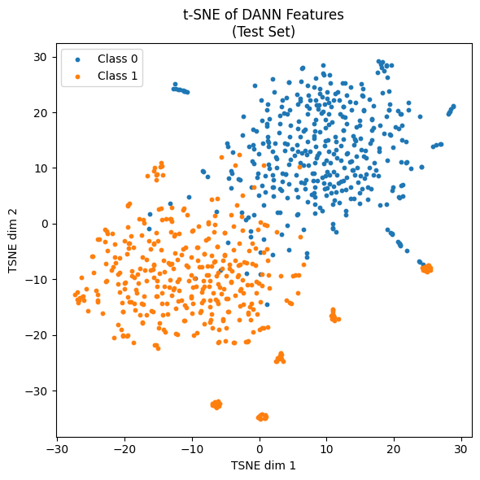

# HCP-fMRI-Domain-Adversarial-Classification
PyTorch implementation of a **Domain Adversarial Neural Network (DANN)** for **face vs. shape classification** on **Human Connectome Project (HCP) fMRI data**.  
The model learns **domain-invariant** features across subjects and reaches **96.62% test accuracy** with strong ROC-AUC and PR-AUC.

---

## TL;DR
- **Task:** Face vs. Shape classification on HCP task fMRI  
- **Method:** DANN (feature extractor + label head + domain discriminator via **Gradient Reversal Layer**)  
- **Why:** Address subject distribution shift / domain shift in fMRI  
- **Results:** Val **96.88%**, Test **96.62%**, ROC-AUC **0.9922**, AP **0.9913**  
- **Goodies:** Training & evaluation scripts, pretrained checkpoints, plots, and dataset link

---

## 📌 Overview
Functional MRI (fMRI) signals vary widely across individuals, making generalization challenging.  
This project applies **domain-adversarial training** (DANN) to align source and target distributions via a **Gradient Reversal Layer (GRL)**.  
Compared to CNN/Transformer baselines, DANN significantly improves cross-subject classification.

**Key features:**
- Clean **PyTorch** DANN implementation  
- **Two-script structure** (`train.py` + `evaluate.py`)  
- **Pretrained models** for reproducibility  
- **Plots & metrics** (ROC, PR, t-SNE)  
- Compatible with both `.mat` and `.npz` datasets  

---

## Method
We adopt the classic DANN architecture with three components:

1. **Feature Extractor**: maps fMRI inputs (optionally PCA-reduced) to latent features.  
2. **Label Predictor**: classifies *face* vs *shape* from the latent features (supervised on source).  
3. **Domain Discriminator**: distinguishes **source** vs **target** features; connected via a **Gradient Reversal Layer (GRL)** so the extractor learns domain-invariant representations.

**Training pipeline**
1. **Preprocess** fMRI (robust scaling + **PCA**).  
2. **Adversarial training** on labeled source and **unlabeled target** (only `X_test` used for domain alignment; no target labels).  
3. **Evaluate** on held-out subjects and generate plots.

---

## Results (on a subset of HCP data)
- **Validation Accuracy:** **96.88%**  
- **Test Accuracy:** **96.62%**  
- **ROC AUC:** **0.9922**  
- **Average Precision (PR):** **0.9913**

- The feature space shows clear separation between classes, indicating effective domain alignment and minimal subject-specific leakage.

